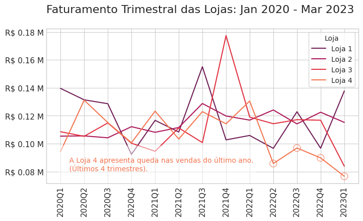
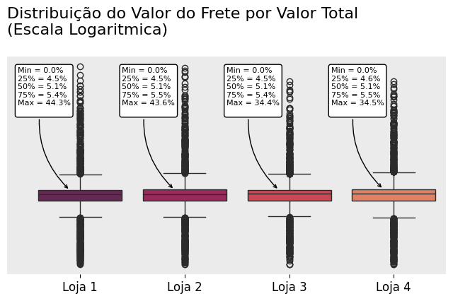

<h1 align="center"> Resolução do Challenge Alura Store DS1 </h1>

Resolução do Challenge 1: Alura Store da formação de Data Scientist da Alura.

## Sobre do Desafío:
Neste desafio, iremos ajudar o Senhor João a decidir qual loja da sua rede Alura Store vender para iniciar um novo empreendimento. Para isso, analisaremos dados de vendas, desempenho e avaliações das 4 lojas fictícias da Alura Store. O objetivo é identificar a loja com menor eficiência e apresentar uma recomendação final baseada nos dados.

No desafío praticaremos:

- Carregar e manipular dados CSV com a biblioteca Pandas.
- Criar visualizações de dados com biblioteca Matplotlib.
- Analisar métricas como faturamento, avaliações e desempenho de vendas.

### Requisitos:

1. Analisar os dados das lojas:
    - Avaliar informações como faturamento, categorias mais vendidas, avaliações dos clientes, produtos mais vendidos e frete médio.

2. Criar gráficos para visualização:
    - Decidir quais tipos de gráficos usar para apresentar os resultados de maneira clara e visual.
    - Mínimo de 3 gráficos diferentes, que podem incluir gráficos de barras, pizza, dispersão, entre outros.

3. Apresentar uma recomendação:
    - Após as análises, escrever um texto explicando qual loja o Senhor João deve vender e por quê, com base nos dados apresentados.

## Sobre a Entrega:
Com base nas análises realizadas e nos gráficos gerados, sintetizar as descobertas em um relatório final. Dentro do seu Colab, escrever um texto explicando qual loja o Senhor João deve vender, levando em consideração todos os fatores analisados, como:

- O faturamento total das lojas.
- As categorias de produtos mais e menos vendidas.
- A média das avaliações de clientes por loja.
- Os produtos mais e menos vendidos.
- O frete médio de cada loja.

No relatório, incluir a justificativa para a decisão, apoiada nas análises e nas visualizações geradas. Explicando, de forma clara e objetiva, os motivos pelos quais uma loja se destaca (ou não) em relação às outras, considerando os pontos fortes e fracos de cada uma.

O relatório deve ser bem estruturado, com uma introdução que explique o objetivo da análise, um desenvolvimento com a apresentação dos dados e gráficos, e uma conclusão recomendando a loja que deve ser vendida e justificando a escolha.

## Sobre o desenvolvimento:
- O desenvolvimento foi feito usando o [Google Colaboratory](https://colab.research.google.com/).
- O notebook com o desenvolvimento pode ser revisado [aqui](Alura_DataScience_Challenge1.ipynb).
- Os requerimentos estão listados do arquivo [requirements.txt](requirements.txt).

**Importante:** Para poder rodar o código que gera o mapa de calor do Brasil é necessario subir no Colab os arquivos da pasta [dados](dados).

## Relatotio:

### Objetivo
O presente estudo tem como objetivo avaliar o desempenho das 4 lojas da rede Alura Store no periodo de Janeiro de 2020 até Março de 2023. E com isso determinar a loja com o menor desempenho.

Os fatores estudados para a avaliação das lojas são os seguintes:

- Faturamento.
- Categorias de produtos.
- Avaliações dos clientes.
- Produtos vendidos.
- Frete.
- Concentraçao das vendas por Estado.

### Fatores estudados

#### 1. Faturamento:
  - De forma geral a Loja 4 apresenta o menor faturamento de entre as 4 lojas.

    
    
  - Além disso, quando agrupamos as vendas por trimestres pode se observar uma queda consistente de faturamento na Loja 4 no último ano.

    
  
#### 2. Categorias de produtos:
  - A distribuição da quantidade de produtos vendidos por Categoria é bastante similar em cada uma das lojas, o que significa que não temos alguma loja que se destaque pela venda de alguma Categoria em particular. Por isso, acreditamos que este criterio não é determinante para a escolha da loja que deve ser vendida.

    

#### 3. Avaliações dos clientes:
  - As avaliações médias dos clientes em cada loja é muito próxima, estando todas ao redor de 4.

    
    
  - A distribuição das avaliações também é muito similar em cada loja. Se consideramos apenas as melhores avaliaçoes (4 e 5) observamos que as lojas 1 e 4 apresentam a menor proporçao de avaliações nestas categorias. Por outra parte, novamente, as lojas 1 e 4 apresentam a maior quantidade de avaliaçoes na categoria mais baixa (5).

    
    
  - Quando obtemos as avaliações médias em cada trimestre por cada uma das lojas podemos ver um comportamento estável (estacionario) da avaliação media.

    
    
  - Em conclusão, neste fator, as lojas 1 e 4 apresentam a menor performance, mas a diferença com as outras lojas não é marcante.    

#### 4. Produtos vendidos:
  - Os produtos vendidos são muito diversos, a seguir se exibem os 5 produtos mais vendidos e 5 produtos menos vendidos em cada loja.

    
    
  - Podemos salientar nas vendas por produto que a diferencia entre o produto mais vendido e menos vendido não ultrapassa o 1,5%. Isto é, não temos uma diferençã muito grande entre o produto mais vendido e menos vendido em cada uma das 4 lojas.

#### 5. Frete:
  - O frete medio por loja va de 31,3 até 34,7 reais.

    
    
  - No entanto, para compreender melhor a percepção do cliente do frete acreditamos que é apropriado ver que proporção representa o frete com respeito ao Valor Total pago pelo cliente. Nesse sentido, a distribuição do Valor do Frete pelo Valor Total mostra que esse valor tem uma distribuição bastante similar em cada loja com uma mediana de 5,1% em todas as lojas e valores dos Primeiro e Terceiro quartis que são quase os mesmos em cada loja.

    
    
  - Em resumo, acreditamos que a percepção do frete pelo cliente não é muito diferente em cada loja. Pelo que consideramos que esse fator não seja muito forte para nos ajudar a decidir qual loja deve ser vendida.

#### 6. Concentraçao das vendas por Estado:
  - A distribuição das vendas no Brasil para cada uma das lojas é bastante similar.

    
    
  - Em todas as lojas a venda se concentra nas regiões Sul e Sudeste, sendo o estado de São Paulo o estado que concentra a maior parte das vendas com ao redor de 40%. Os estados de Rio de Janeiro, Minas Gerais, Paraná e Rio Grande do Sul seguem em importancia segundo o nível de Vendas.
  - Devido a essa similaridade na distribuição territorial das vendas acreditamos que a venda de alguma loja terá quase o mesmo impacto na cobertura por Estado das vendas.

### Conclusão
  - Após a análise de todos os fatores estudados, entendemos que os fatores de Categorias de produtos, Avaliações dos Clientes, Produtos vendidos e Concentração de vendas não mostram diferenças significativas entre as lojas.
  - Por outra parte o fator Faturamento mostra que Loja 4 apresenta a pior performançe, com um menor faturamento total e uma queda consistente nas vendas no último ano.
  - Por tanto, recomendamos a venda da Loja 4.
